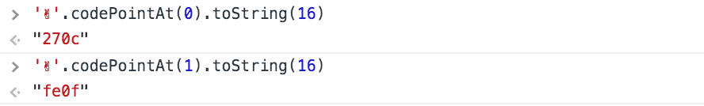
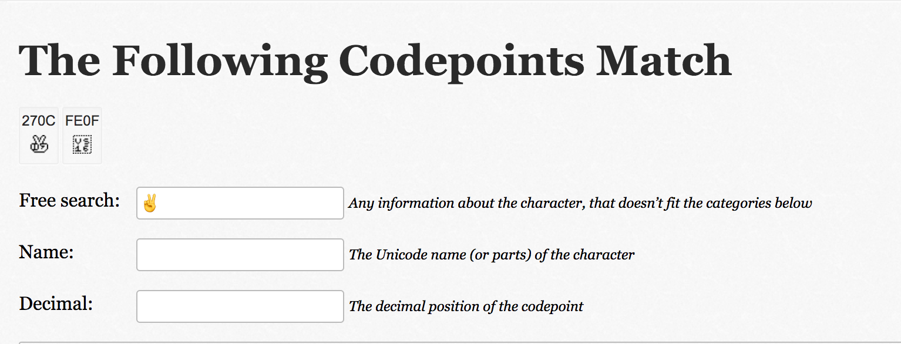
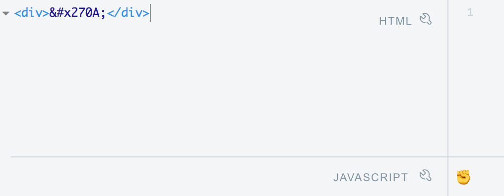
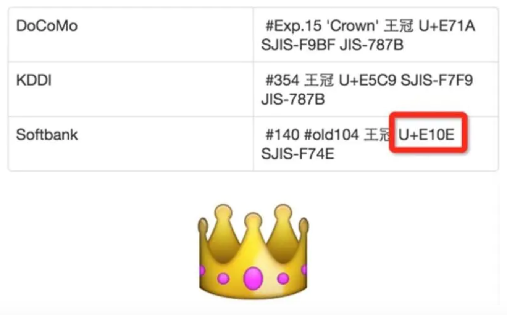
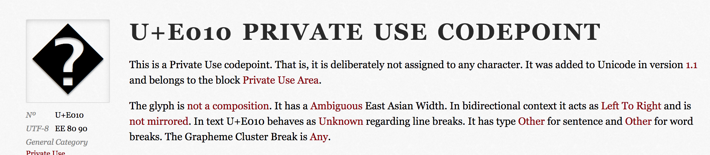
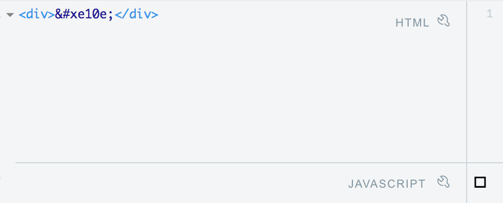

##  emoji的显示

#### 会出现的问题：乱码+显示不一致

原因：各平台对Unicode标准实现不一致

#### emoji 表情是否能在不同的系统中正常显示，不出现乱码？

只要在unicode的编码中能找的到，那就能正常显示

[查询字符对应的unicode]([https://codepoints.net/search?q=%E2%9C%8C%EF%B8%8F](https://codepoints.net/search?q=✌️))

在html中显示unicode，需要 &#x;表示，270A就是uicode码

https://codepoints.net/U+270A

这个就有可能会显示乱码，https://codepoints.net/U+E010，因为不是unicode标准编码，也就是第三方自定义的字符

#### 参考文章

[那些年我们踩过的乱码坑](https://juejin.im/entry/5747b5fea34131006277312b)