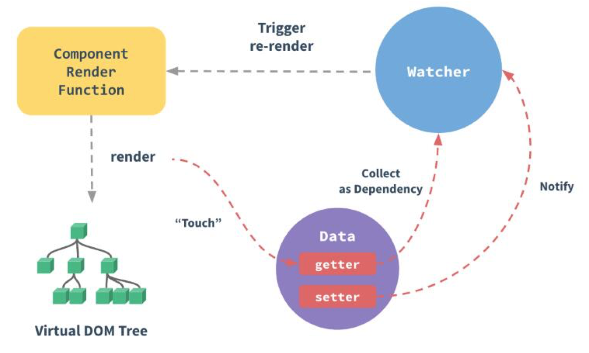
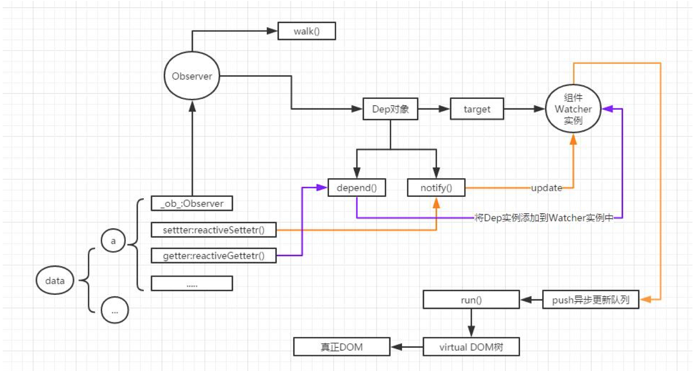

## vue响应式原理

### 概括来说
* 把数据放到vue的data后，数据增加三个属性，__ob__、getter()、setter()
* 初始化阶段，解析html，找出其中的directive(如v-model)，以及其关联的数据。创建一个directive1实例，创建一个Observer1对象，data1.__ob__就指向Observer1
* Observer1对象有一个属性 -> 指向当前的Dep对象（只有一个）
* 当调data.setter()，触发Dep.depend(),收集依赖（将watcher1添加到Dep的watchers数组中）
* Dep对象有depend()+notify()两个方法，target：Watchers[watcher1(关联着directive1),watcher2]
* 当调data1.getter(),触发notify(),然后通知Watcher1对directive1->Vdom->真实dom一路进行更新，这里会有一个异步更新队列。

### 细致来说
vue作为一种MVVM框架，视图响应数据变化是它的一大特点，那么是时候来探索一下它背后的原理了，本文仅代表现阶段个人的理解，如有错误欢迎指出。以下是一幅很关键的图，也是官网给出的图。



vue响应式有很关键的三个元素Observer，Watcher，Directive
其实底下这个图有点乱，大致可以理解下，因为分两个阶段，有些部分串起来了，具体还是参考着文字走吧，我是这么觉得的。


## Init 初始化阶段

### 目标
当把一个普通的数据放入vue的data中后会有如下变化
1. this.a = this.$data.a 通过实例对象直接能访问到数据
2. 通过console.log打印数据，将会变成下图的样子，发现多了：

* __ob__属性
* getter方法
* setter方法


### 怎么做

那么Vue都做了些什么呢？请往下看

src/core/instance/state.js
>initState
>>initProps
>>initMethods
>>initData ( 重点 )
>>initComputed
>>initWatch 

initData 方法
>initData
>>proxy()   // 实现第一项目标
>>observe()

##### proxy方法：
 遍历data的key，通过(es5)Object.defineProperty的getter和setter方法将其所有属性代理到vm实例上

##### observe方法：
1. 检测是否已经添加了__ob__属性
2. 检测是否满足条件
3. 创建一个Observer对象
4. 将Observer对象作为该对象的属性 __ob__:Oberver

##### Observer类 
> walk()             // 如果属性是对象，让它拥有getter和setter方法
> Dep对象            // 简单的观察者模式
> > target           // 开始为null，（编译阶段）指向当前组件的Watcher实例
> > depend()         // collect dependencies (收集依赖) ——getter方法会触发
> > notify()         // dispatch updates (通知更新) ——setter方法会触发


## Complier 编译阶段
### 目标
建立Watcher和Directive和Observer的联系
* Observer的Dep建立watcher队列，那么当数据更新时去通知这些watcher
* 同时每个watcher又对应一个directive这样就可以更新数据了
* 官网上有这么一段话，但我通过源码的理解是一个组件有很多的directive，每个directive对应一个watcher，同时这个watcher是在组件实例的watchers数组中的
>每个组件实例都有相应的 watcher 实例对象，它会在组件渲染的过程中把属性记录为依赖，之后当依赖项的 setter 被调用时，会通知 watcher 重新计算，从而致使它关联的组件得以更新。

### 怎么做

1. vm.complier()将template转换为document.fragment(拿到el对象)
2. 解析其中包含的指令(解析器Parser)
    * 指令所依赖的数据 this.a
    * 指令的更新方式 
3. 创建Directive实例，将其添加到directive数组中
4. 为Directive初始化一个Watcher(expOrFn,callback)，将其push到组件实例的watchers中
``` js
this.vm = vm
vm._watchers.push(this)
```
5. 向Watcher构造函数中传入指令的expression(String),例如"a"
``` js
// 把 expression 转化为 getter()  
//这里不是很理解 expression 和 expOrFn的关系
if (typeof expOrFn === 'function') {
  this.getter = expOrFn  //如果是函数那么直接赋值
} else {
  this.getter = parsePath(expOrFn)  //不然的话转换一下
  if (!this.getter) {
    this.getter = function () {}
    process.env.NODE_ENV !== 'production' && warn(
      `Failed watching path: "${expOrFn}" ` +
      'Watcher only accepts simple dot-delimited paths. ' +
      'For full control, use a function instead.',
      vm
    )
  }
}
```
6. Watcher 的get()调用pushTarget(): 将Dep.target指向当前Watcher实例
7. Watcher 的get()调用 this.getter.call(vm, vm)，触发此Watcher依赖项属性的getter，调用其dep.depend()重新收集依赖，其实也就是把该watcher添加到所有依赖项dep对象的watcher队列中，
然后把其dep添加到当前watcher的deps数组中，这样数据更新时就会调用dep的notify来通知其关联watcher(也就是队列中的所有watcher),来让它们都调用update更新

```js
// Watcher的get()方法
  get () {
    pushTarget(this)    //将Dep.target指向当前Watcher实例
    let value
    const vm = this.vm
    if (this.user) {
      try {
        value = this.getter.call(vm, vm)
      } catch (e) {
        handleError(e, vm, `getter for watcher "${this.expression}"`)
      }
    } else {
      value = this.getter.call(vm, vm)  // 触发实例data上所有属性的getter重新收集依赖
    }
    // "touch" every property so they are all tracked as
    // dependencies for deep watching
    if (this.deep) {
      traverse(value)
    }
    popTarget()    // 依赖收集完毕后，再调用Dep.popTarget()，让dep的target=null
    this.cleanupDeps()
    return value
  }
```
当前运行的 Watcher 只能有一个，也就是Dep.target的指向

``` js
// Dep 的 pushTarget() 和 popTarget ()
Dep.target = null
const targetStack = []

export function pushTarget (_target: Watcher) {
  if (Dep.target) targetStack.push(Dep.target)
  Dep.target = _target
}

export function popTarget () {
  Dep.target = targetStack.pop()
}

```


``` js
//Dep类
export default class Dep {
  static target: ?Watcher;
  id: number;
  subs: Array<Watcher>;  // Watcher队列 
```

``` js
//调用属性的setter触发其Dep.depend()
  depend () {
    if (Dep.target) {
      Dep.target.addDep(this)  // 为当前Watcher实例添加这个Dep
    }
  }
```

``` js
// Watcher的addDep()方法
// Add a dependency to this directive.

  addDep (dep: Dep) {
    const id = dep.id
    if (!this.newDepIds.has(id)) {
      this.newDepIds.add(id)
      this.newDeps.push(dep)
      if (!this.depIds.has(id)) {
        dep.addSub(this)  //调用Dep 的addSub()，将此Watcher添加到这个dep的watcher队列中
      }
    }
  }
```

``` js
// Dep 的addSub()
addSub (sub: Watcher) {
    this.subs.push(sub)
  }
```

``` js
// Dep的notify()
  notify () {
    // stabilize the subscriber list first
    const subs = this.subs.slice()
    for (let i = 0, l = subs.length; i < l; i++) {
      subs[i].update()    //通知Watcher队列的所有watcher去调用update()
    }
  }
}

```

## 数据更新

* 通过 setter()更新数据
* 触发 Dep.notify()
* 调用 Watcher 实例的 update()
    * 满足条件，调用 Watcher 实例的 run() 更新 DOM
    * 如果同一个 Watcher 被多次触发，为了减少 DOM 操作
    会将 Watcher 实例 push 到一个异步更新队列中 

``` js
 update () {
    /* istanbul ignore else */
    if (this.lazy) {
      this.dirty = true
    } else if (this.sync) {
      this.run()
    } else {
      queueWatcher(this)
    }
  }
```

## Virtural DOM

Vue2.0 引入了很多特性

> 轻量 体积小 runtime-only 压缩后只有16kb
> 支持服务器流式渲染
> 用 VirtualDOM 对渲染层进行了重写

### 问题
不当的 DOM 操作很容易引起浏览器重排，对性能来说是一大杀手
### 方式
Virtual DOM 是在js操作和DOM操作之间的一个中介，就好比内存之于CPU和硬盘
### 步骤
1. 用js对象模拟一棵DOM树 (节点类型 属性 子节点)
3. 基于状态变化，生成另一棵变化后的树
2. 比较两棵虚拟DOM树之间的差异 
3. 找出从一棵树到另一棵树变化的最小步骤(diff算法)
4. 把差异部分应用到真正的DOM上

## 参考文章

* [囧克斯Vue源码学习笔记](http://jiongks.name/blog/vue-code-review/)
* [慕课手记——Vue 源码解析：深入响应式原理](http://www.imooc.com/article/14466)
* [知乎回答——怎么更好的理解虚拟DOM](https://www.zhihu.com/question/29504639)