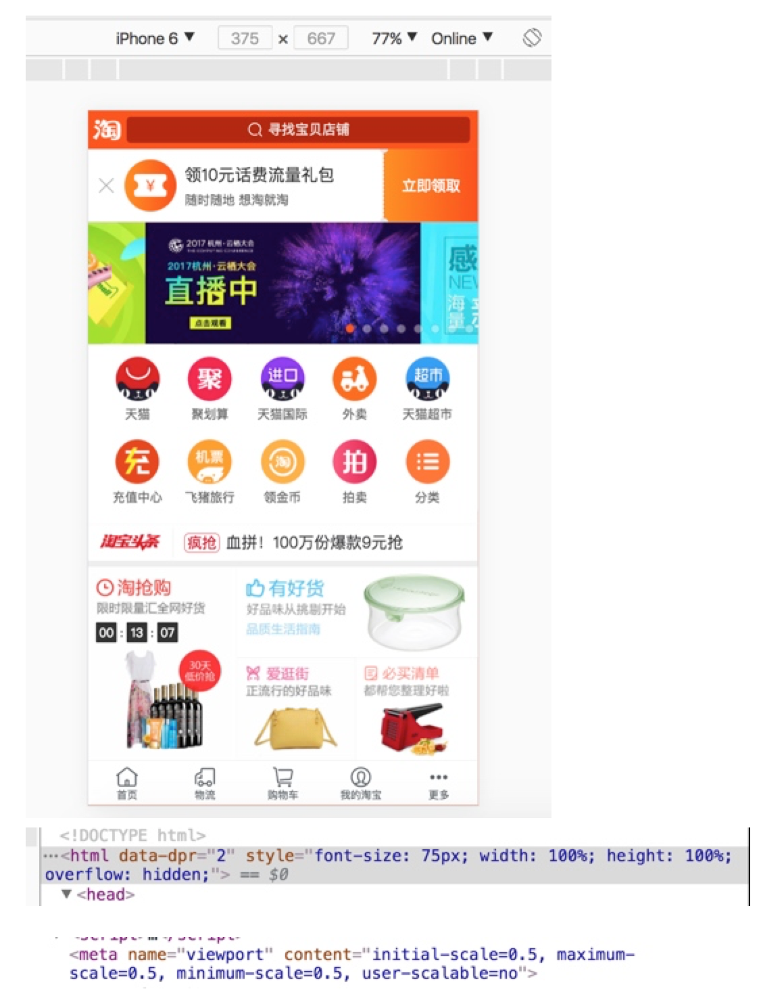
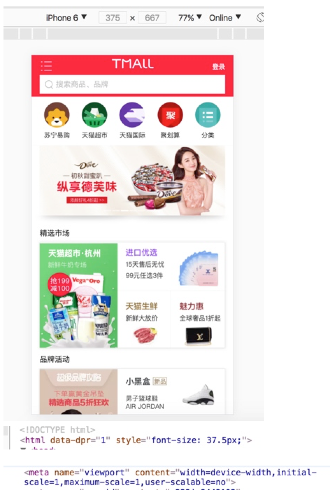
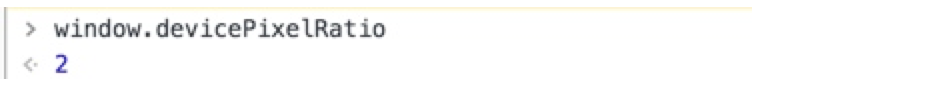

## rem 自适应

750的设计稿，如何进行自适应？

**常见设置**

- 视口viewport的宽度 = 布局viewport的宽度 = device-width
- scale＝3，将理想viewport放大3倍，layout viewport的尺寸保持不变 

```htm``l
<meta id="viewport" name="viewport" content="width=device-width; initial-scale=1.0; maximum-scale=1; user-scalable=no;">
```

**dpr**

| iphone | 5~6  | 6plus |
| :----: | :--: | :---: |
|  dpr   |  2   |   3   |

**获取layout viewport**

```js
// html节点（document.documentElement）
document.documentElement.clientWidth  //375
```

#### 第一步：动态改变html的font-size

- **第一种方式**

font-size = device-width / 10

|           |  414   | 375  | 320  |
| :-------: | :----: | :--: | :--: |
| font-size | 82.8px | 75px | 64px |

150px / 75 ( 设计稿／100 ) = 2rem
计算比较麻烦，需要配合px2rem。

- **第二种方式**

font-size = device-width /（设计稿／100）

|           |  414   | 375  |  320   |
| :-------: | :----: | :--: | :----: |
| font-size | 55.2px | 50px | 42.7px |

150px / 100 = 1.5rem; 计算比较简单

#### 第二步：动态改变meta标签的scale

dpr = 物理像素 / css像素
机子显示1px（dpr＝2），则css需要设为0.5px，相当于会被放大显示，所以scale需要缩小对应的倍数。

|       | dpr＝1 | dpr=2 | dpr=3 |
| :---: | :----: | :---: | :---: |
| scale |   1    |  0.5  | 0.333 |

```js
// 只对iOS设备进行dpr的判断，对于Android系列，始终认为其dpr为1

if (!dpr && !scale) {
    var isAndroid = win.navigator.appVersion.match(/android/gi);
    var isIPhone = win.navigator.appVersion.match(/iphone/gi);
    var devicePixelRatio = win.devicePixelRatio;
    if (isIPhone) {
        // iOS下，对于2和3的屏，用2倍的方案，其余的用1倍方案
        if (devicePixelRatio >= 3 && (!dpr || dpr >= 3)) {                
            dpr = 3;
        } else if (devicePixelRatio >= 2 && (!dpr || dpr >= 2)){
            dpr = 2;
        } else {
            dpr = 1;
        }
    } else {
        // 其他设备下，仍旧使用1倍的方案
        dpr = 1;
    }
    scale = 1 / dpr;
}
```

#### 第三步：文字不建议用rem

- 不希望出现 13px 15px 这些字号
- 不希望文本在Retina屏幕下变小
- 希望在大屏手机上看到更多文本

```js
// css
div {
    width: 1rem; 
    height: 0.4rem;
    font-size: 12px; // 默认写上dpr为1的fontSize
}
[data-dpr="2"] div {
    font-size: 24px;
}
[data-dpr="3"] div {
    font-size: 36px;
}

// 或者用js修改

function setBodyFontSize () {
    if (document.body) {
      document.body.style.fontSize = (12 * dpr) + 'px'
    }
    else {
      document.addEventListener('DOMContentLoaded', setBodyFontSize)
    }
  }
```

**蘑菇街**


**手淘**



**天猫**



三个版本的dpr都是2



``` js
(function(doc, win) {
    var docEl = doc.documentElement,
        resizeEvt = 'orientationchange' in window ? 'orientationchange' : 'resize',
        recalc = function() {
            var clientWidth = docEl.clientWidth;
            if (!clientWidth) return;
            docEl.style.fontSize = 20 * (clientWidth / 320) + 'px';
        };
    if (!doc.addEventListener) return;
    win.addEventListener(resizeEvt, recalc, false);
    doc.addEventListener('DOMContentLoaded', recalc, false);
})(document, window);
```

