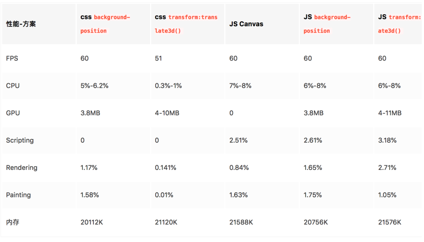

## 动效实现的方式

- GIF（文件大、有毛边、不可以控制动画）
- 视频（隐藏控件、自动播放、循环播放）

- - Canvas视频组件

- - - [jsmpeg](https://github.com/phoboslab/jsmpeg) 必须ts格式（修复ios不能自动播放问题）、大小建议2M（因为不能预加载），

- - 原生video组件（部分安卓机无法隐藏控件、自动播放等）

- CSS Animation（也可以用WebAnimation API操作）
- AE转（bodymovin插件导出---Lottie前端也是转成Canvas或SVG）[【从AE到Web 凹凸实验室】](https://juejin.im/entry/5aa62779f265da238d505bb9)
- 序列帧

- - CSS @keyframes background-position
  - **CSS keyframes** **transform（推荐）**
  - Canvas （不断的刷新绘制每一帧）
  - SVG（可按照特定路径运动）

- 图片处理转换工具：gae、apngjs
- 游戏引擎

- - 2D：[Hilo](http://hiloteam.github.io/)（轻量）、[CreateJs](https://www.createjs.com/)、[SpriteJs](https://spritejs.org/#/)
  - 3D：thtreeJs、pixi

## 问题&注意点

#### 图片、动画数量、动画帧数过多

可能会存在的问题：前边的加载时间过长，动画卡顿、内存、CPU等资源占用过高

解决方式：减少动画数量，低端机降级（可以减少动画数量），滑出屏幕时暂停动画

**一些动画需要给到原始的静态图，方便做降级替换**

整体算下来，会在25-26个左右

场馆：6 x 3 = 18（小的动效）

其他：3-4 人物走动

版头：视频 / 序列帧 / AE导出

气泡：2（CSS写）

#### 适配方案：rem+scale

rem 的计算会存在误差，因此使用雪碧图时我们并不推荐用 rem。如果是逐帧动画的话，由于计算的误差，会出现抖动的情况。那么在触屏页中，如何实现页面的适配？

- 非逐帧动画部分，使用 `rem` 做单位；
- 逐帧动画部分，使用 `px` 做单位，再结合 `js` 对动画部分使用 `scale` 进行缩放。

#### 帧动画素材的要求

每一帧的图片最好是偶数宽高，偶数张，最好周围能有一些留白（防止抖动）

### 参考文章

- [序列帧&一镜到底H5开发实现分析](https://mp.weixin.qq.com/s/--rPuk-cYDTrT6RB0O6lWQ)
- [逐帧动画抖动解决方案 | 凹凸实验室](https://aotu.io/notes/2017/08/14/fix-sprite-anim/index.html)
- [帧动画的多种实现方式与性能对比 | 迅雷前端](https://juejin.im/post/5c7bd2646fb9a049cb197921)