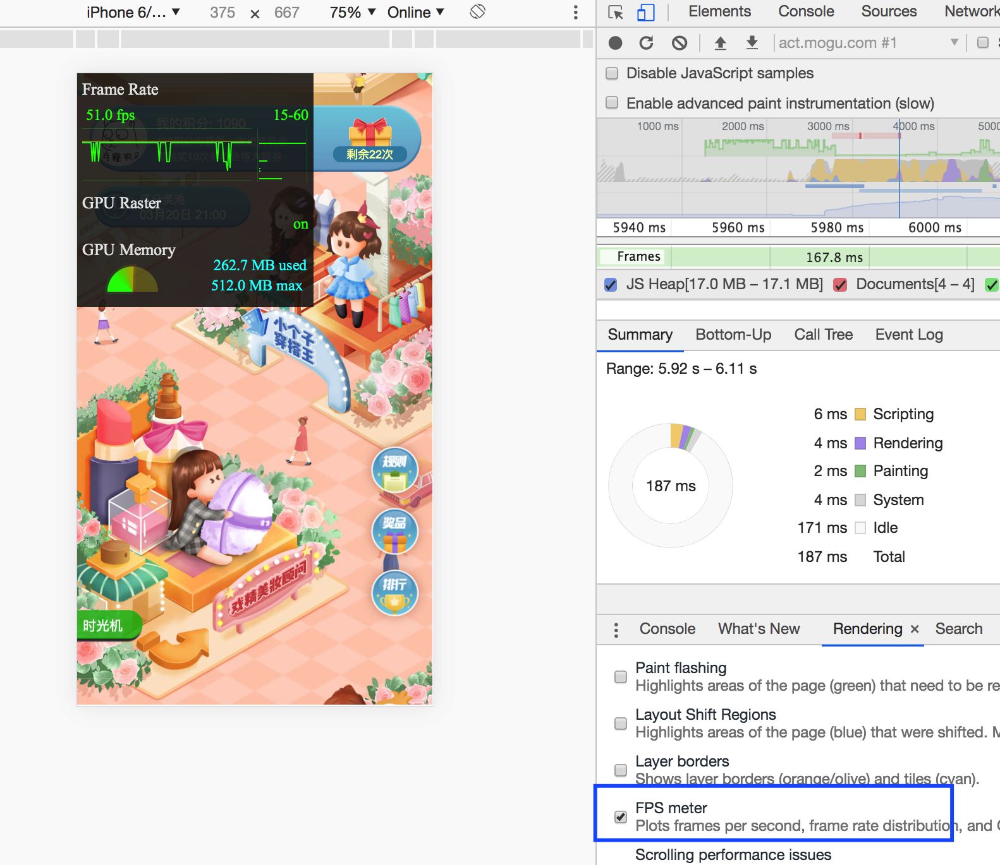
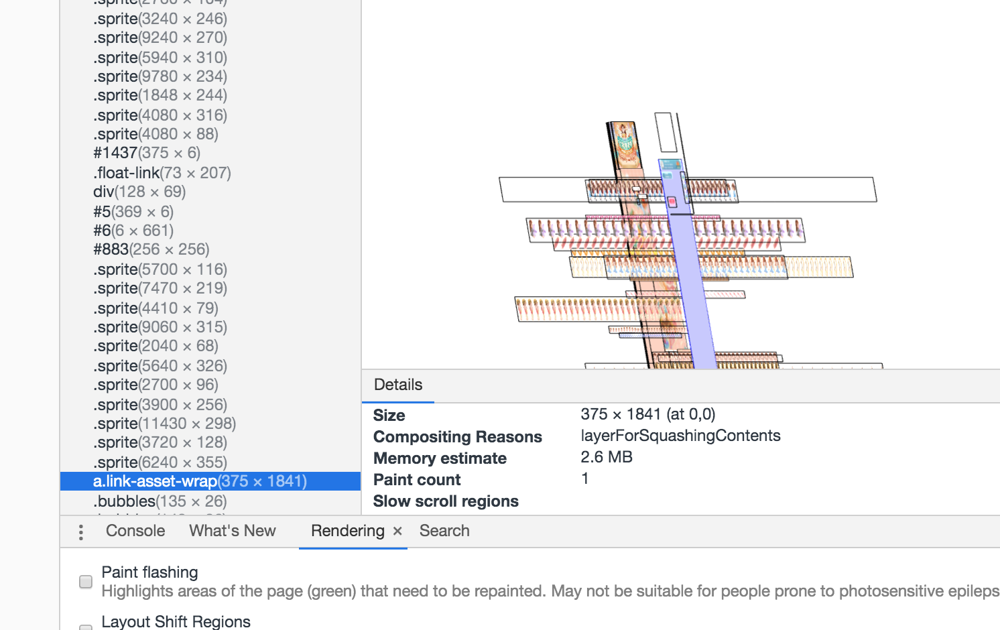

## 动画优化

开启实时的fps记录

#### 过度使用GPU的问题

一般会动画元素会使用transform3d来优化，这样元素会渲染到一个独立层（不影响其他元素导致重绘），而且会交由GPU渲染。

但是如果页面中独立层过多，可能导致消耗内存过大，浏览器崩溃（每个复合层都需要消耗额外的内存），在滚动时动画会有闪烁（安卓比较明显）

* GPU传输需要消耗，存储需要消耗
* 层数过多
* 层的尺寸过大

#### 隐式合成层

像下边紫色区域是6部分的点击区域，虽然没有GPU加速，但是由于加了zindex，高于动画渲染层，所以它被自动加到一个单独的合成层中

#### 优化

1. 减小复合层的大小，width/height减小，然后用transform scale放大
2. 使用canvas（只是取其中一帧去绘制，不会把整个序列帧图片都加载到内存）

#### 参考文章

https://fed.taobao.org/blog/2016/04/26/performance-composite/

https://segmentfault.com/a/1190000014520786