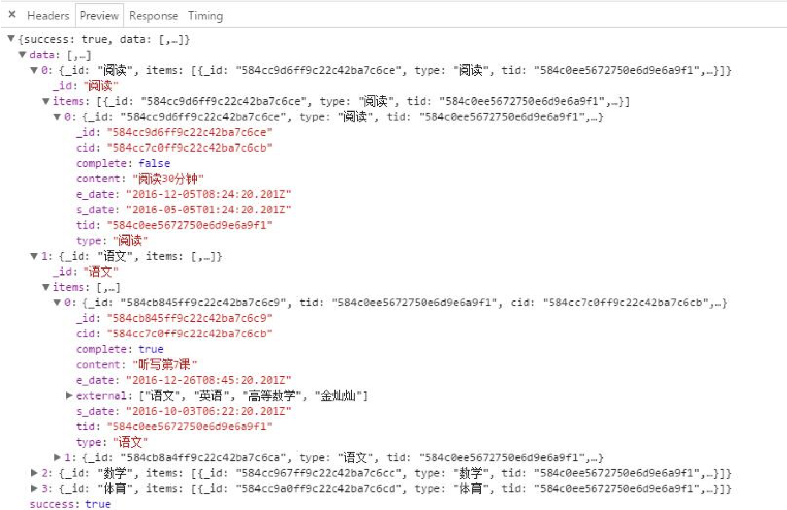

## 关于node异步流程控制

背景问题：对查询结果，二次循环插入一个字段，这个字段是数据库再次查询而得。最后将结果返回时，发现为空？？

## 闭包
#### 常见问题： 

比较常见的闭包问题就像fun1所示，本来应该依次输出0-9，然而最后输出都为10。因为setTimeout是异步的，我的理解是i++执行的速度比console.log()快很多，所以i一下子就加到了10，最后输出就都是10。

#### 解决方式：
用闭包如fun2，创建一个独立的作用域，可以把每一次的i保存下来，fun3中的forEach也是如此

``` js
function fun1(){
    for(var i = 0; i < 10; i++){
        setTimeout(function(){
            console.log(i);
        },1000)
    }
}

function fun2(){
    for(var i = 0; i < 10; i++){
        (function(i){
            setTimeout(function(){
                console.log(i);
            },1000)
        })(i)
    }
}

function fun3(){
    var i_array = [0,1,2,3,4,5,6,7,8,9];
    i_array.forEach(function(i){
        setTimeout(function(){
                console.log(i);
        },1000)
    })
}
```


fun1();
fun2();
fun3();

#### 执行结果：
``` html
---------------fun1--------------   
10
10
10
10
10
10
10
10
10
10
---------------fun2--------------
0
1
2
3
4
5
6
7
8
9
---------------fun3--------------
0
1
2
3
4
5
6
7
8
9
```


## node异步流程控制

#### 常见的处理方式：
* callback
* eventproxy
* bluebird 
* async

我这边mongoose的Promise用的是bluebird,解决回掉金字塔。异步流程控制用的是朴大大的eventproxy，因为看了很久bluebird的文档，折腾了下失败了，听说很强大。

#### bluebird 替代mongoose的Promise
``` bash
npm i bluebird -D
```
_app.js_

``` js    
var Promise = require('bluebird')
Promise.promisifyAll(mongoose)
```

bluebird中promisifyAll，将对象所有的方法都统一处理，用的时候就方法名后+Async即可
#### eventproxy 流程控制

每次二次查询结束后，提交一个事件

``` js    
ep.emit('task_ready')
```

然后在ep.after中监督，n为提交次数，等所有事件都完毕后，再将结果返回

``` js
ep.after('task_ready', n, function(){
    console.log(tasks)
    resjson(res,true,tasks,null)
})
```

``` js
//查询当天或者一段时间的作业及完成情况
getTasksByDate: function(req, res, next){ 
    var sid = '584c0e7c672750e6d9e6a9ee'
    var n = 0
    Task.aggregateAsync(
            {$match: {s_date:{$gt:new Date(2016,1,1),$lt: new Date(2016,12,25)}}},
            {$group: {_id: '$type', items: {$push: "$$ROOT"}}}
        )
        .then(function(tasks){           
            //两次循环，对请求的数据增加 complete字段
            tasks.forEach(function(task){
                n += task.items.length
            })            
            var ep = new EventProxy()
            tasks.forEach(function(task){
                task.items.forEach(function(subTask){
                    DoTask.findOneAsync({sid:sid,taskId:subTask._id})
                      .then(function(stu_task){
                            console.log(stu_task)
                            subTask.complete = stu_task ? true : false
                            ep.emit('task_ready')
                      })
                      .catch(function(err){
                         console.log(err)
                      })
                })                
            })
            ep.after('task_ready', n, function(){
                console.log(tasks)
                resjson(res,true,tasks,null)
            })
        })
        .catch(function(err){
            console.log(err)
            res.send('error')
        })

}
```

#### 执行结果：
可以看到complete新字段被成功插入



## 参考资料：

[1] [eventproxy github](https://github.com/JacksonTian/eventproxy "With a Title").
[2] [bluebird英文文档](http://bluebirdjs.com/docs/getting-started.html "With a Title").
[3] [bluebird中文文档](http://itbilu.com/nodejs/npm/VJHw6ScNb.html#api-promise.props "With a Title").
[4] [alsotang的《使用 eventproxy 控制并发》](https://github.com/alsotang/node-lessons/tree/master/lesson4 "With a Title").