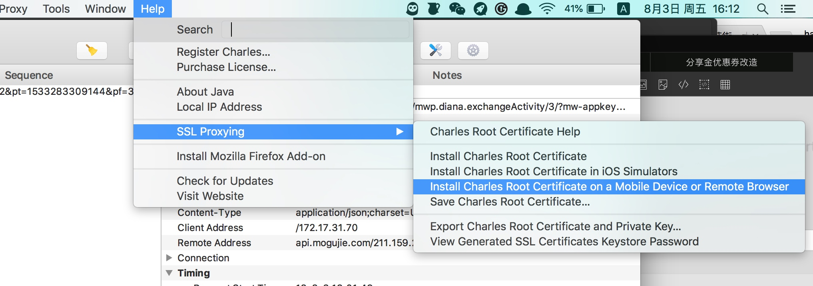
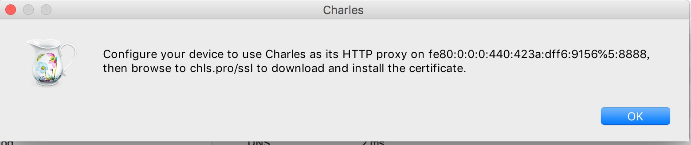
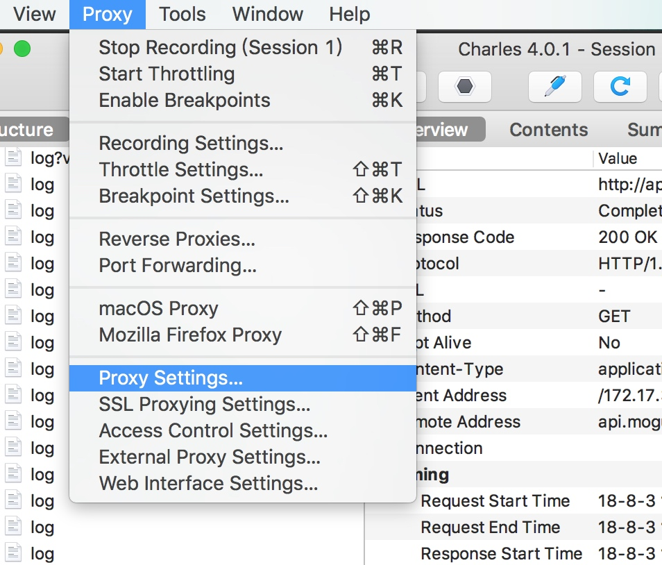
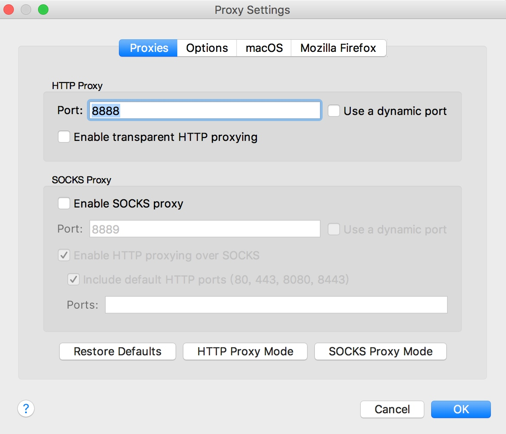
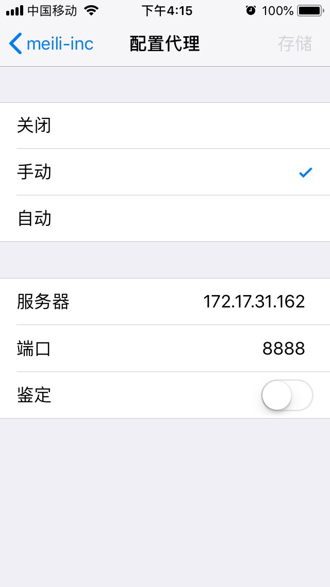
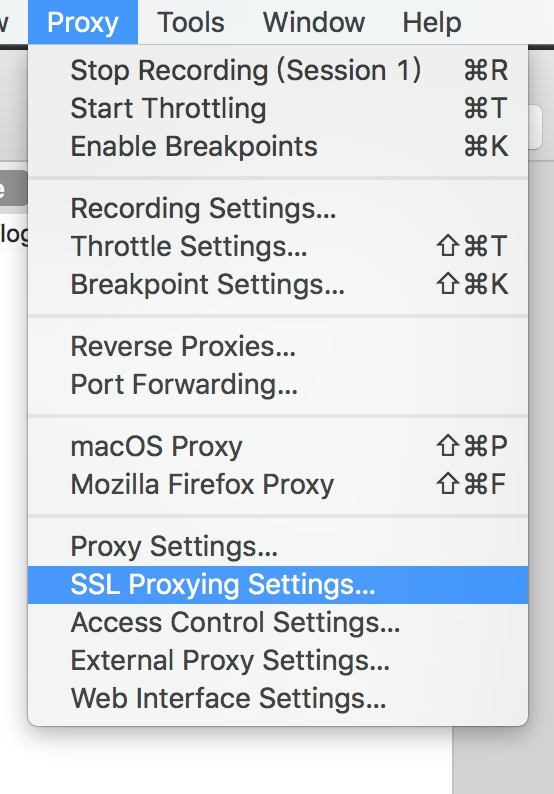
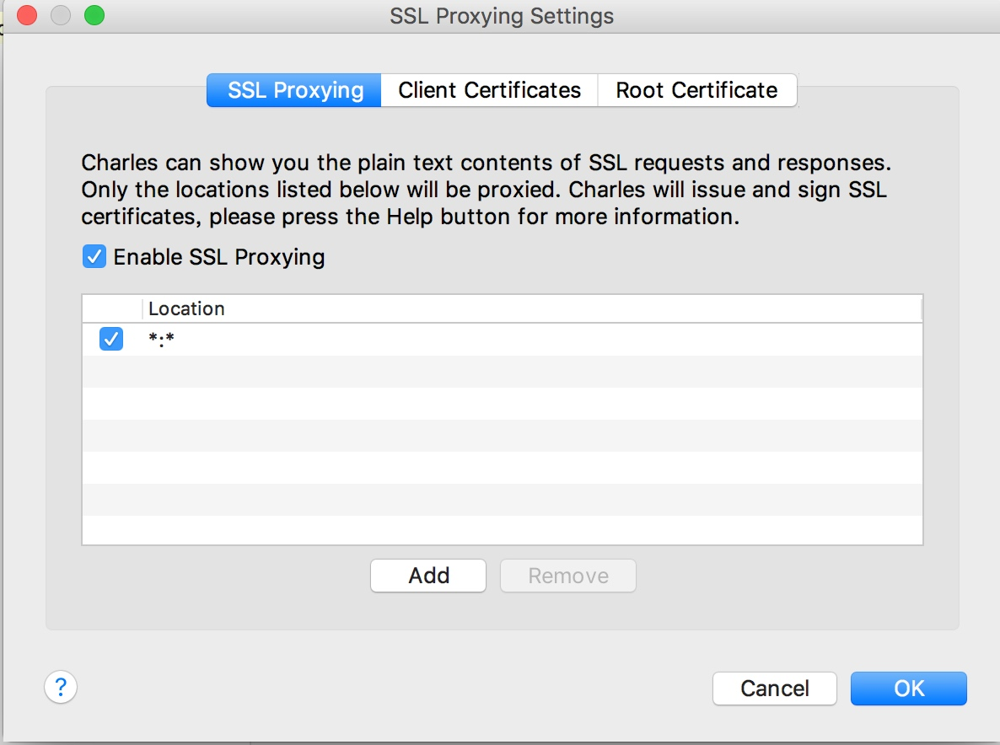

## Charles 将手机所有请求代理到电脑

**Charles 将手机所有请求代理到电脑，电脑怎么访问，手机也怎么访问**

### 1. 在手机上安装插件

### 2. 手机 safari 访问 chls.pro/ssl 安装插件，并信任（通用-描述文件与设备管理）

### 3. 手机配置网络代理

### 4. 设置 ssl 的请求

### 5. 添加 https 白名单 

**就可以看到 https 请求的内容了**

