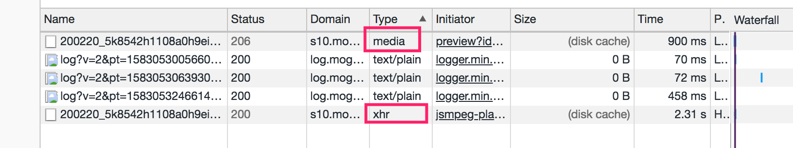
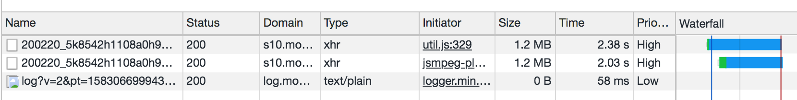
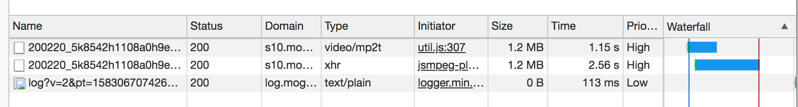
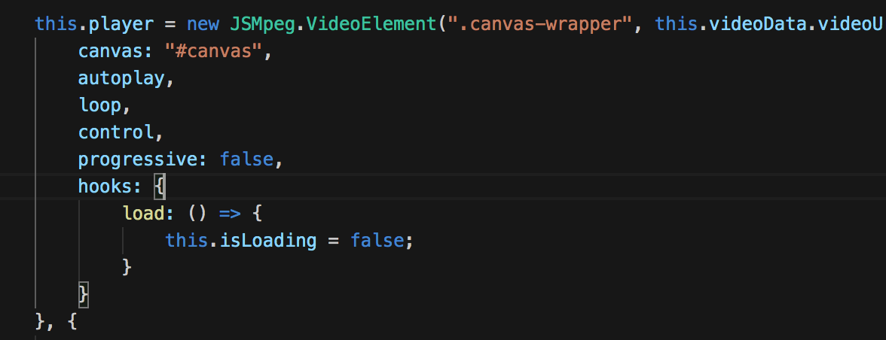

## 资源预加载

[quicklink](https://juejin.im/post/5c21f8435188256d12597789) 是一个通过预加载资源来提升后续速度的轻量级工具库

#### **如何去预加载一个资源**？

第一种：prefetch与preload

```js
<link rel="prefetch" href="xxx.js" as="script">
```

第二种：XHR 利用浏览器自身的缓存（由于浏览器的差异，XHR的成功率更高）

第三种：标签


#### 资源的优先级

* html+css+font
* preload、script、xhr
* 图片、音频、视频（图片资源会根据图片是否在可见视图之内来改变优先级）
* prefetch（比较老的属性，兼容性比较好）


#### 预加载的策略？

在可视区才去加载


#### **资源的缓存**

* LocalStorage（可以缓存js）


#### 举一个实际的 🌰

第一屏有一个loading动画，第二屏有一个使用 [jsmpeg](https://github.com/phoboslab/jsmpeg/issues/256)（canvas绘制ts格式）的视频，想要预加载

视频格式

- TS & FLV & MP4
  - TS 特点是从视频流的任一片段开始都是可以独立解码的，比mp4大10%左右。一般视频过大时可用作分片请求

视频编码

* H.264 & H.265

  * H.265压缩效率更高，传输码率更低，视频画质更优
    
  * H.264支持的机型范围更


#### 接下来开始我们的实验.....

##### 第一种是video标签

```
<video preload width="1" height="1" controls src="./static/videos/1.mp4"></video> 
```
因为jsmpeg内部是发起了一个xhr请求，如果是用video做预加载，type不一致



##### 第二种是xhr

开始没有指定 `responseType` 会有跨域问题，后来我把jsmpeg内部的xhr拷了一份没有跨域

```js
// xhr 请求（虽然请求一致，实测也是发起了两个请求）
export function preloadVideo(url) {
    return new Promise((resolve) => {
        let request = new XMLHttpRequest();

        request.onreadystatechange = function() {
            if (
                request.readyState === request.DONE && 
                request.status === 200
            ) {
                resolve();
            }
        }.bind(this);

        request.open('GET', url);
        request.responseType = "arraybuffer";
        request.send();
    });
}
```




##### 第三种的 link preload

注意必须要指定as，否则请求无法成功

```js
// link（发起两个请求，type不一样）
export function preloadVideo(url) {
    return new Promise((resolve) => {
        const link = document.createElement(`link`);
        const isSupportPrefetch = (link.relList || {}).supports && link.relList.supports('prefetch');
        const isSupportPreload = (link.relList || {}).supports && link.relList.supports('preload');

        if (!isSupportPrefetch && !isSupportPreload) {
            return resolve('fail');
        }

        link.rel = isSupportPreload ? 'preload' : 'prefetch';
        link.href = url;
        link.as = "fetch";
        link.crossorigin = true;
        console.log(link);
        document.head.appendChild(link);
        link.onload = () => {
            console.log('加载完毕');
            resolve('success');
        };
    });
}
```




##### 发现这样一圈试下来，没什么效果。。

最后发现jsmpeg其实就有一个onload事件，所以就是加载时用图片盖在canvas上，加载完成再隐藏图片




#### 参考文章

[quicklink 的实现原理与给前端的启发](https://juejin.im/post/5c21f8435188256d12597789)

[短视频宝贝=慢？阿里巴巴工程师这样秒开短视频](https://yq.aliyun.com/articles/680859?utm_content=g_1000032362)

[浏览器页面资源加载过程与优化](https://juejin.im/post/5a4ed917f265da3e317df515)

[css加载会造成阻塞吗](https://juejin.im/post/5b88ddca6fb9a019c7717096)