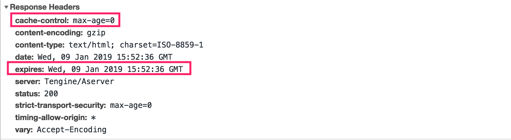
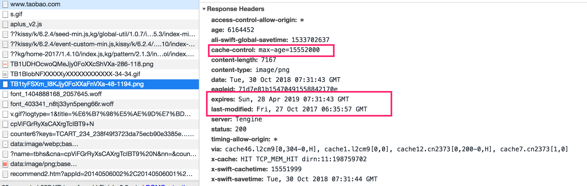

## 浏览器缓存

#### 缓存位置（优先级由上至下）

* service work

  ```
  Service Worker 是运行在浏览器背后的独立线程,传输协议必须为 HTTPS。因为 Service Worker 中涉及到请求拦截，所以必须使用 HTTPS 协议来保障安全。Service Worker 的缓存与浏览器其他内建的缓存机制不同，它可以让我们自由控制缓存哪些文件、如何匹配缓存、如何读取缓存，并且缓存是持续性的
  
  self.addEventListener('install', function(event) { 
    /* 安装后... */
    // cache.addAll：把缓存文件加进来，如a.css,b.js
  });
  
  self.addEventListener('activate', function(event) {
   /* 激活后... */
   // caches.delete ：更新缓存文件
  });
  
  self.addEventListener('fetch', function(event) {
    /* 请求资源后... */ 
    // cache.put 拦截请求直接返回缓存数据
  });
  ```

* memory cache（内存/短期缓存/不受控制）

  ```
  tab关闭就失效，会忽略 max-age / no-cache，除了no-store
  ```

* disk cache：http头部（cache-control / pragma）决定是否存入

  ```
  对于大文件来说，大概率是不存储在内存中的，反之优先
  当前系统内存使用率高的话，文件优先存储进硬盘
  ```

* push cache（http2 推送缓存）

* 网络请求

  

#### 强缓存

https://juejin.im/post/58b7850ba22b9d005ecd6243

https://juejin.im/post/58bd35beac502e006b19d5f8

* Cache-Control（http1.1）

  * max-age

    ```
    这个指令指明获取的响应从当前请求开始允许被重用的最大时间限度（单位为秒）。例如：“max-age=60”说明响应在接下来的60秒内可以被缓存和重用。
    ```

  * s-maxage

    ```
    代理缓存，如 CDN 缓存，优先级高于 max-age
    ```

  * public

    ```
    所有内容都将被缓存（客户端和代理服务器都可缓存）。具体来说响应可被任何中间节点缓存，如 Browser <-- proxy1 <--  proxy2 <-- Server，中间的proxy可以缓存资源，比如下次再请求同一资源proxy1直接把自己缓存的东西给 Browser 而不再向proxy2要
    ```

  * private

    ```
    默认值。只能被客户端缓存
    
    如果响应被标志为“public”，那么它是可以被缓存的，即使它有HTTP认证信息，甚至响应状态码不是正常的可缓存。大多数情况下，“public”不是必须的，因为明确的缓存信息（比如“max-age”）已经说明响应是可以被缓存的。
    
    相比之下：“private”响应可以被浏览器缓存，但是通常只为单个用户缓存，一次不允许任何中继缓存件对其进行缓存——比如，一个包含用户私人信息的HTML页面可以被这个用户的浏览器所缓存，但是不能被CDN缓存。
    ```

  * no-cache

    ```
    不使用强制缓存
    ```

  * no-store 

    ```
    不使用强制缓存，也不使用协商缓存
    
    “no-cache”指明当前返回的响应在后续相同的URL请求时必须先与服务器确认响应是否被修改，之后才能被用作后续请求响应的缓存。因此，如果我们有一个合适的验证令牌（ETag），no-cache会增加一次与服务器的通信来验证和确认缓存的响应，但是可以避免重复下载不曾更新的响应。
    
    相比之下，“no-store”更加简单，它直接禁止所有的浏览器和中继缓存存储任何版本的响应——比如：一个包含了个人隐私信息或者银行信息的响应。每次用户请求这些资源的时候，都会发送一个请求到服务器并且下载完整的响应内容。
    ```

  * no-transform

  * must-revalidate

    ```
    向源站请求,非代理服务器的缓存,对应的 proxy-revalidate
    ```

  https://aotu.io/notes/2016/09/22/http-caching/index.html

  ##### no-cache和max-age=0的区别？

  https://stackoverflow.com/questions/1046966/whats-the-difference-between-cache-control-max-age-0-and-no-cache

  ```
  基本差不多。都会跳过强缓存，走协商缓存
  
  那么看起来IE9将使用它来配置使用后退和前进按钮时的资源行为。当使用max-age = 0时，浏览器将在后退/前进按下时查看资源时使用最后一个版本。如果使用no-cache，则将重新获取资源。
  ```

  

  

  

  https://stackoverflow.com/questions/1046966/whats-the-difference-between-cache-control-max-age-0-and-no-cache

  

  [扼杀 304，Cache-Control: immutable](https://www.cnblogs.com/ziyunfei/p/5642796.html)

  [chrome的做法](http://www.cnblogs.com/ziyunfei/p/6308652.html)

  ```
  只对页面本身的资源文件进行条件请求（如果缓存了的话），页面里引用的各种子资源文件，只要缓存不过期，就直接读取缓存
  ```

  

  ```
  Cache-Control: max-age=3600, immutable，表明该资源能存活一小时，在一小时之内，即便用户刷新也不要发送条件请求，在过期之后，浏览器会发送不带一个不带 If-Modified-Since 和 If-None-Match 的请求来更新资源，这里需要注意，一旦被标志成 immutable，则这个资源不可能返回 304 响应了，只有 200
  
  目前 Firefox 的实现里，只对 HTTPS 资源开放 immutable 属性的支持
  
  immutable 只有在你的网站被频繁刷新的情况下才有较大的意义
  
  少数人知道的强制刷新功能（Ctrl+F5/Shift+Command+R）以及开发者工具的跳过缓存功能优先级应比 immutable 更高
  ```


```
200(缓存)是最快的，因为没有请求发生。304则产生了HTTP请求：浏览器发送一个带有If-Modified-Since的请求，服务器根据情况返回304来告诉浏览器使用本地文件。

所以304比200（缓存）慢一点，静态文件都应该使用Expires头来减少请求，提高访问速度。（根据HTTPWATCH的说法：“Don’t cache HTML, Cache everything else forever”）
```


* Expires（http1.0，优先级低）当前时间 + 缓存时间

  1. 第一次请求，会把这个资源连同所有response header一起缓存下来
  2. 浏览器再请求这个资源时，先从缓存中寻找，找到这个资源后，拿出它的Expires跟当前的请求时间比较，如果请求时间在Expires指定的时间之前，就能命中缓存，否则就不行
  3. 如果缓存没有命中，浏览器直接从服务器加载资源时，Expires Header在重新加载的时候会被更新

  缺点：绝对时间和服务器时间有误差；缓存命中率低

* Prama（http1.0）

  pragma是http/1.0实现的头部, pragma的值会出现在页面meta标签的http-equiv属性中,以此来控制页面缓存

  ```
  Pragma: no-cache，只有这么一种写法
  ```

  

  ```
  // Pragma 优先级高于cache-control
  Cache-Control: public, max-age=86400
  Pragma: no-cache
  ```


#### Html Meta

```
<meta http-equiv="Cache-Control" content="no-cache" /> <!-- HTTP 1.1 -->
<meta http-equiv="Pragma" content="no-cache" /> <!-- 兼容HTTP1.0 -->
<meta http-equiv="Expires" content="0" /> <!-- 资源到期时间设为0 -->
```

但现在w3c的规范字段中这些值已经被移除，一个很好的理由是：

> Putting caching instructions into meta tags is not a good idea, because although browsers may read them, proxies won't. For that reason, they are invalid and you should send caching instructions as real HTTP headers.

其实也很好理解，写在meta标签中代表必须解析读取html的内容，但代理服务器是不会去读取的。大多浏览器已经不再支持，会忽略这样的写法，所以缓存还是通过HTTP headers去设置。

*注：HTTP Headers中的缓存设置优先级比meta中http-equiv更高一些。*


##### 常用写法


#### 协商缓存

* Etag + if-none-match 计算：文件修改时间（16进制）+ 文件长度（16进制）


* Last Modified + if-modified-since（优先级低）

分布式系统里多台机器间文件的Last-Modified必须保持一致，以免负载均衡到不同机器导致比对失败；

分布式系统尽量关闭掉ETag(每台机器生成的ETag都会不一样）；


#### ETag主要是解决Last-Modified无法解决的一些问题：

- 一些文件也许内容并未改变（可能仅仅改变了修改时间），这时候我们不希望文件被重新加载，此时，ETag值会触发缓存，Last-Modified不会。
- If-Modified-Since能检查到的粒度是秒级的，当修改非常频繁时， Last-Modified会触发缓存，而ETag不会触发缓存，需重新加载。
- 某些服务器不能精确的得到文件的最后修改时间。


 








#### 一些操作对于缓存的影响

- POST 请求不能被缓存

- f5 —— 浏览器会设置max-age=0，跳过强缓存

- ctrl + f5 —— 跳过强缓存和协商缓存

- chrome 无痕模式

  从官方的介绍来看，“隐身模式”不会再计算机上留下您访问网站的任何痕迹，包括缓存文件、Cookie、历史记录、下载记录等等

- Disable cache


## 静态资源版本更新

https://github.com/fouber/blog/issues/6

* 加版本号 ?v=1.0.0 或者时间戳 ?t=xxxx。 同文件名，覆盖式发布


* 文件内容hash（数据摘要算法），精确控制单个文件的缓存，递归计算hash（依赖文件）

* 非覆盖式发布，先全量部署资源再灰度部署页面。


#### 数据摘要算法

MD5、SHA1、 SHA256


### webpack hash

* hash：项目 'bundle.[name].[hash].js'
* chunkhash：entry.js
* contenthash：

文件不会重复构建

https://imweb.io/topic/5b6f224a3cb5a02f33c013ba


#### 静态资源的增量更新

https://tech.meituan.com/fe_and_golang.html


#### 多页面

```
listen 80;
server_name localhost;
location /admin {
    root /home/wordspace/admin;
    index index.html;
    try_files $uri /index.html;
}
location / {
    root /home/workspace/vue;
    index index.html;
    try_files $uri /index.html;
}
```


## CDN

#### CDN是什么？有什么作用？

内容分发网络，目的是减小传播时延，设置了不同的节点（缓存）

分流、减轻源站压力

#### 怎么搭建？

DNS 调度服务器 + 节点服务器

缓存命中率  X-Cache-Lookup

#### CDN全站加速

只需要修改 DNS 的 CNAME 

##### 为什么使用CDN需要 CNAME 记录?

https://www.cnblogs.com/YDDMAX/p/5592647.html

常见的dns记录类型有A，AAAA，CNAME等。A记录是域名到IPV4地址的；AAAA记录是域名到IPV6地址的；A记录会直接解析到某个IP，CNAME会解析到另一个域名，之后再对另一个域名继续解析，直到解析出节点。

用户需要在域名服务商处，配置一条 CNAME 记录，将访问加速域名的请求指向这个 example.qiniudns.com 域名记录，生效后访问加速域名时解析将会正式指向七牛云 CDN ，之后由CDN完成调度，使得该域名所有的请求都开始享有CDN加速效果


使用CNAME记录可以很方便地变更IP地址。如果一台服务器有100个网站，他们都做了别名，该台服务器变更IP时，只需要变更别名的A记录就可以了


#### CDN 缓存

开发者可以通过CDN服务商提供的“刷新缓存”接口来达到清理CDN边缘节点缓存的目的

这是一种以空间换时间的方案，减少了用户的访问延时，也减少的源站的负载。

客户端浏览器先检查是否有本地缓存是否过期，如果过期，则向CDN边缘节点发起请求，CDN边缘节点会检测用户请求数据的缓存是否过期，如果没有过期，则直接响应用户请求，此时一个完成HTTP请求结束；如果数据已经过期，那么CDN还需要向源站发出回源请求。

**更新机制**

CDN边缘节点缓存策略因服务商不同而不同，但一般都会遵循http标准协议，通过http响应头中的Cache-control: max-age的字段来设置CDN边缘节点数据缓存时间。另外可通过CDN服务商提供的“刷新缓存”接口来更新缓存。


#### DNS缓存

浏览器——本地host——运营商


自建 DNS 服务器


http://taobaofed.org/blog/2015/12/16/h5-performance-optimization-and-domain-convergence/

收敛域名

- 减少 DNS 请求
- 缩短 DNS 解析路径


发布时，发布到回源机，然后cdn从回源机上取


https://juejin.im/post/5b8e83c3518825430c7a8019

https://imweb.io/topic/5795dcb6fb312541492eda8c

http://www.alloyteam.com/2016/03/discussion-on-web-caching/

https://juejin.im/post/5c32ac69f265da6150649ec2