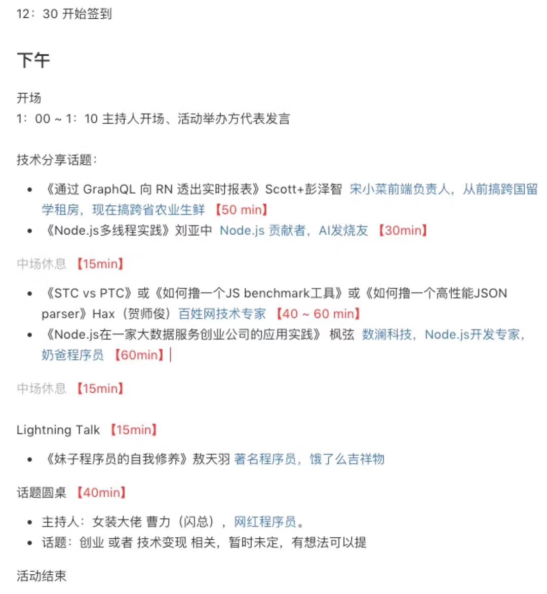
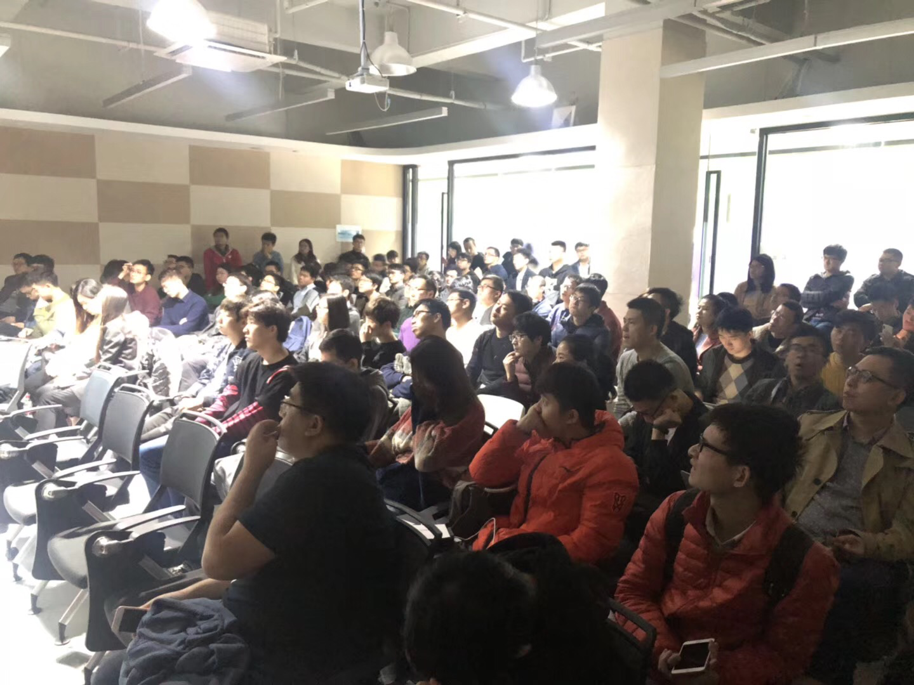

##  杭州 NodeParty 第五期
有天看到芋头发了一个报名链接，也就报名了，没错和多数人的目的一致，为了见天总（敖天羽，饿了么吉祥物）一面。这期 NodeParty 在丁香园举办，持续6小时，b站有直播，下期貌似会在杭电。

#### 行程安排

#### 天哥
饿了么吉祥物，本次她分享的是妹子程序员，算是她12月3日的live的预告，不过这次到场妹子寥寥无几，and丁香园员工占了30多个。

#### 活动 cut
话筒有回音，加上语速篇慢，整场有点昏昏欲睡的感觉。贺老的分享比较燃，高桥流的 ppt，站在四大浏览器厂商讲了 STC 和 PTC 的内容，印象深刻。
每次 talk 结束后会有提问环节，有些问题含金量比较高，也有不少在最后为自己公司打广告的。
中场休息准备了小零食（可乐、雪碧、德芙、旺旺仙贝...），走心了～

最后环节——圆桌大会，讨论的是知识变现：开live，卖app，做线上课程，外包。

